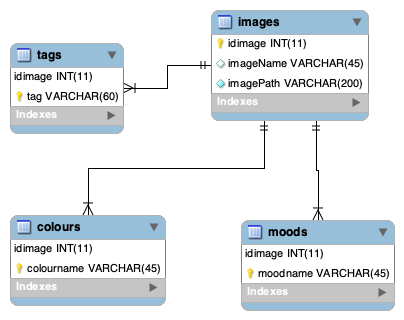

# Image repository

small project creating a searchable image repository

* Using a simple web interface to allow users to view curated collection of images
* storage is a mySQL database that stores the path to the image that is stored in the filesystem. In a larger implementation, the images could stored with some cloudservice and the DB would store the path to access the files instead of saving them on the same web server
* images were sourced from unsplashed.com
* using php to connect the web interface to the database
* users can anonymously add images

## E/R diagram of database

## Possible extensions

* User login, so images are tied back to a creator
* More complex searches
* Allow users option to declare new colours / moods not specified in upload page
* Improve UI